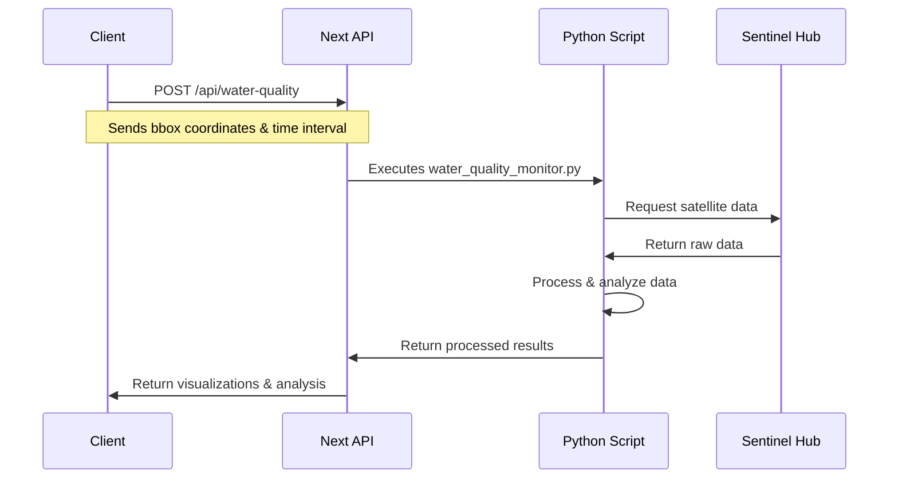

# Sentinel API Implementation Workflow

## Overview

This document describes the workflow between the frontend application and the Sentinel API data retrieval system. The implementation consists of a Next.js frontend that communicates with a Python backend script, which in turn interfaces with the Sentinel Hub API.

## Architecture Flow



## 1. Frontend Request (Next.js API Route)

Location: `frontend/src/app/api/water-quality/route.ts`

The frontend initiates the process through a POST request with the following structure:

```typescript
interface RequestBody {
  bboxCoords: [number, number, number, number]; // [west, south, east, north]
  timeInterval: [string, string];               // [startDate, endDate]
  dataSource?: string;                         // satellite data source
}
```

### Validation Steps:
- Validates coordinate bounds (-180 to 180 for longitude, -90 to 90 for latitude)
- Checks bounding box size (max: 10° x 10°, min: 0.001° x 0.001°)
- Validates time interval format
- Verifies data source if specified

## 2. Python Script Integration

Location: `GIS/water_quality/water_quality_monitor.py`

The Python script handles the core functionality of retrieving and processing satellite data.

### Supported Data Sources:

```python
data_sources = {
  "sentinel2": {
    "collection": DataCollection.SENTINEL2_L2A,
    "bands": {
      "red": "B04",
      "green": "B03", 
      "blue": "B02",
      "nir": "B08",
      "swir1": "B11",
      "swir2": "B12"
    },
    "resolution": 10,
    "mosaicking_order": MosaickingOrder.LEAST_CC
  },
  "sentinel2_l1c": { ... },  # Non-atmospherically corrected
  "landsat8": { ... }        # Landsat-8/9 L2
}
```

### Processing Capabilities:

1. **NDWI Calculation**
   ```javascript
   // Normalized Difference Water Index
   NDWI = (Green - NIR) / (Green + NIR)
   ```

2. **True Color Visualization**
   - Combines RGB bands (B04, B03, B02)
   - Applies enhancement for better visibility

3. **Water Detection**
   - Uses NDWI thresholding (> 0.03 for water bodies)
   - Creates overlay visualization

## 3. Data Retrieval Process

The Python script interfaces with the Sentinel Hub API through the following steps:

1. **Configuration**
   - Sets up Sentinel Hub authentication
   - Configures request parameters based on input

2. **Data Request**
   ```python
   def get_sentinel_data(
       bbox_coords,
       time_interval,
       resolution=60,
       data_source="sentinel2",
       debug=False
   ):
       # Configure Sentinel Hub request
       # Retrieve satellite imagery
       # Process bands for analysis
       # Return processed data
   ```

3. **Processing Pipeline**
   - Retrieves raw satellite data
   - Calculates water indices
   - Generates visualizations
   - Creates analysis outputs

## 4. Output Generation

The system generates multiple outputs:

```typescript
{
  imageUrl: `/results/water_quality_${analysisId}.png`,      // Main analysis
  rgbImageUrl: `/results/water_quality_${analysisId}_rgb.png`, // True color
  detailedNdwiUrl: `/results/water_quality_${analysisId}_detailed_ndwi.png` // NDWI
}
```

## 5. Error Handling

The implementation includes comprehensive error handling:

1. **Frontend Validation**
   - Input parameter validation
   - Coordinate range checking
   - Area size limitations

2. **Process Monitoring**
   - Timeout handling (180 seconds max)
   - Script execution monitoring
   - Error visualization generation

3. **Error Response**
   ```typescript
   {
     error: string;
     imageUrl?: string;  // Error visualization if available
     details?: string;   // Additional error information
   }
   ```

## 6. Performance Considerations

- Implements request timeout after 180 seconds
- Caches results using unique analysis IDs
- Cleans up temporary configuration files
- Optimizes image resolution based on area size

## 7. Security Measures

- Validates all input parameters
- Sanitizes file paths
- Implements proper error handling
- Uses secure API authentication

## 8. Future Enhancements

Potential improvements to consider:

1. Implement result caching for repeated requests
2. Add support for additional satellite data sources
3. Enhance water quality analysis algorithms
4. Implement parallel processing for large areas
5. Add real-time progress monitoring 